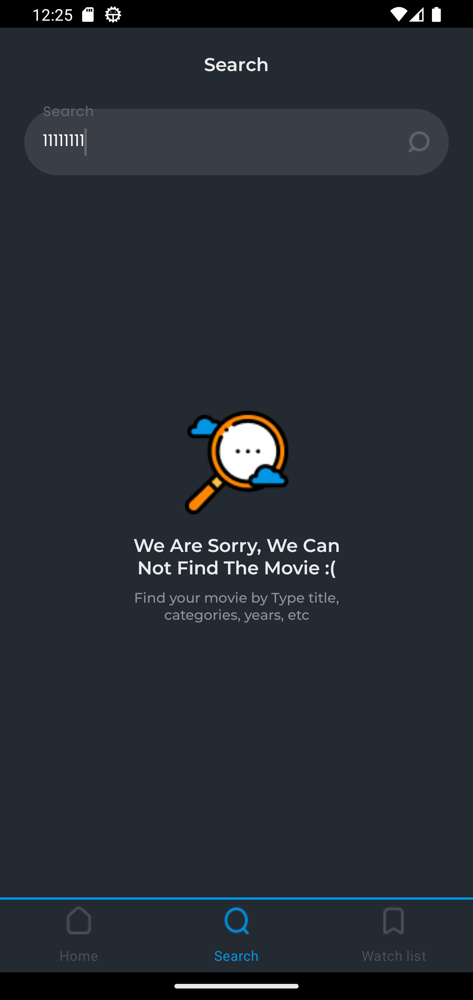

# Movies App

App was written with using of TheMovieDBApi.

## Screenshots from the program

Splash screen

Login screen

Home screen

Search screen

  
  

Watch list

  
  

Details screen

  
  

